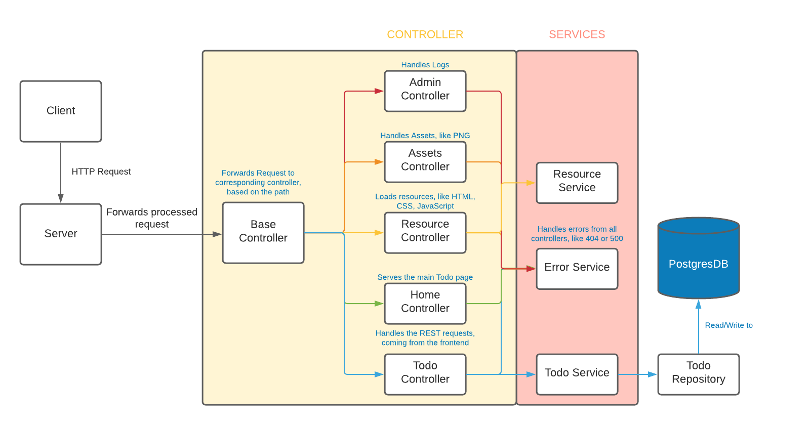

# Code Documentation
In this project we have a running backend, with the server written without any framework.

The general flow of a request is `server.rs` -> `base_controller.rs` -> (specific controller, i.e.) `todo_controller.rs` -> (corresponding service) `todo_service.rs` -> `todo_repository`

Flowchart:

#### Server
Creates the connection socket, and parses the incomming HTTP requests. It is also responsible for sending the response back to the client.

#### Controller
The controller handle the requests, based on the path provided. Specific controller like the `todo_controller.rs` then forward the request to the specific service. In the controller, the request is converted into the corresponding DTO, for the requested method.

#### Service
The `resource_service.rs` is responsible for sending requested resources, i.e. the linked CSS and JavaScript files from the main HTML file.

The `error_service.rs` handles `400`, `404` and `500` errors, thrown in other controller or services.

The `todo_service.rs` is the gateway between the controller and the repository.

#### Repository
Handles the connection to the PostgresDB, using the [Diesel ORM](diesel.rs).